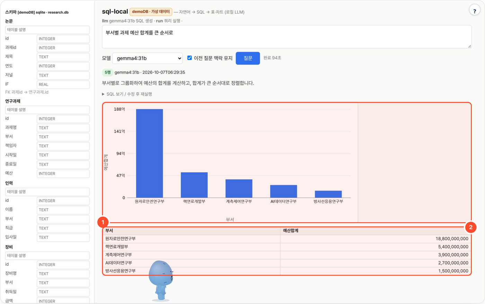

# sql-local — 자연어로 DB에 질문, SQL·표·차트까지 (로컬 LLM)

"부서별 과제 예산 합계 큰 순서로"처럼 한국어로 물으면 로컬 LLM이 SELECT SQL을 짜고, 코드 레벨 안전 필터를 통과한 쿼리만 읽기 전용으로 실행해 표·SVG 차트·설명으로 보여줍니다. 기본 연결은 가상 데이터로 만든 SQLite **demoDB**(`sample/research.db`)입니다.



## 무엇을 하나

- 질문 → SQL 생성 → 실행 → 표(열 정렬·CSV)·자동 차트(막대/선/원)·한 줄 설명. 앞 질문 맥락을 이어 받아 후속 질문도 됩니다.
- **안전장치는 LLM이 아니라 코드가** 맡습니다: 단일 SELECT/WITH만 허용, INSERT·UPDATE·DELETE·DDL 등 차단, LIMIT 500 강제, 10초 타임아웃, 읽기 전용 연결. 실패하면 오류를 LLM에 되돌려 1회 자동 수정합니다.
- 파이썬 표준 라이브러리만(sqlite3 내장), 폴더 복사로 배포. Postgres·MySQL은 드라이버만 pip로 추가합니다.

## 사용 방법

1. **스키마 설명을 채운다** — 왼쪽 스키마 패널의 테이블·컬럼에 한글 설명(예: `IF` = 저널 영향력 지수)을 적고 저장해 두면 SQL 생성이 안정됩니다.
2. **질문하고 실행한다** — 질문 입력 후 **질문** → SQL·표·차트·메타(모델·행 수)를 확인합니다. 위 화면의 ① 자동 차트는 집계 결과를 SVG 막대/선 그래프로 그리고, ② 결과 표는 열 머리글 클릭으로 정렬하고 CSV로 내려받습니다.
3. **SQL을 고치고 이어서 묻는다** — **SQL 보기 / 수정 후 재실행**으로 직접 고쳐 다시 돌리거나(LLM 호출 없음), "이전 질문 맥락 유지"를 켠 채 "그중 2024년만" 같은 후속 질문을 합니다.

화면 제목 옆 **demoDB · 가상 데이터** 표시는 기본 demoDB에 연결돼 있다는 뜻입니다. `DB_URL`로 실제 DB를 연결하면 사라집니다.

## 예시

demoDB(가상 데이터)에서 실제로 실행한 결과입니다(gemma4:31b, 2026-10-07T06:29:35).

- **입력**: `부서별 과제 예산 합계를 큰 순서로`
- **생성 SQL**:

  ```sql
  SELECT "부서", SUM("예산") AS "예산합계"
  FROM "연구과제" GROUP BY "부서"
  ORDER BY "예산합계" DESC LIMIT 500
  ```
- **결과**: 5행 집계 표 + SVG 막대 차트(위 화면). 부서명과 금액은 `seed.py`가 만든 가상 데이터입니다.

## 설치·실행

```bash
bash setup.sh                      # OS 판별 → Python → LLM 서버 탐색/세팅 → selftest → http://localhost:8772
python3 seed.py && python3 app.py  # 수동: 샘플 DB 생성 후 기동
DB_URL=/data/ops.db python3 app.py                               # 다른 sqlite
DB_URL=postgresql://user:pw@host/db python3 app.py                # pip install "psycopg[binary]"
DB_URL=mysql://user:pw@host/db python3 app.py                     # pip install pymysql
LLM_API=openai LLM_BASE_URL=http://gpu:8000/v1 LLM_MODEL=Qwen3-32B python3 app.py
python3 app.py --cli "2024년 월별 집행액 추이"                    # CLI
python3 selftest.py                                               # LLM 없이 안전필터·차트·재생성 검증
```

| 환경변수 | 기본 | 설명 |
|---|---|---|
| `LLM_API` | `ollama` | `ollama` 또는 `openai` |
| `LLM_BASE_URL` | `http://localhost:11434` / `http://localhost:8000/v1` | 서버 주소 |
| `LLM_MODEL` | `qwen3:8b` | 기본 모델 (UI에서 변경 가능). 포털로 띄우면 로컬 Ollama `gemma4:31b` |
| `LLM_API_KEY` | (없음) | OpenAI 호환 서버 키 |
| `NUM_CTX` | `16384` | Ollama 컨텍스트 |
| `DB_URL` | `sample/research.db` | sqlite 경로 또는 postgresql:// mysql:// |
| `PORT` | `8772` | |
| `WORKSPACE` | `./_workspace` | 스키마 설명·실행 기록 저장 폴더 (포털이 도구별 데이터 폴더로 지정) |

## 동작

```
질문 ─ 스키마 요약(테이블·열·FK·예시 3행 + 사용자가 UI에서 적은 한국어 설명)
  → LLM 1콜: {"sql", "explanation", "chart":{type,x,y}} (JSON 계약)
  → 안전 필터: SELECT/WITH 단일 문장만 · INSERT/UPDATE/DELETE/DROP/ALTER/PRAGMA/ATTACH 등 차단 · LIMIT 500 강제 · 10초 중단
  → 읽기 전용 실행 → 실패하면 오류 메시지를 넣어 1회 재생성
  → 표(정렬) · SVG 차트(bar/line/pie, 서버 생성) · CSV · SQL 수정 후 재실행(LLM 0콜)
```

- 이전 질문 3개의 SQL·결과 머리를 다음 질문에 넘겨 "그중 2024년만", "그 과제의 논문은?" 같은 후속 질문이 됩니다.
- 왼쪽 스키마 패널에 열 설명(예: `IF` = 저널 영향력 지수)을 적고 저장하면 프롬프트에 들어가 정확도가 올라갑니다. `$WORKSPACE/schema_notes.json`.
- **demoDB**(`seed.py`, 기본 연결): 연구과제 15 · 집행 1,512 · 인력 68 · 장비 19 · 논문 31 — 모두 가상 데이터. 기본 DB를 쓰는 동안 화면 제목 옆에 "demoDB · 가상 데이터" 표시가 붙고, `DB_URL`로 다른 DB를 연결하면 사라집니다.

## 폐쇄망
이 폴더를 복사하면 끝. 외부 통신은 LLM 서버 주소 하나뿐. DB는 읽기 전용으로 열며, 운영 DB에 붙일 때는 읽기 전용 계정을 쓰세요.

## 출처·감사 (Credits)

- 파이썬 표준 라이브러리(sqlite3)만 씁니다. 선택 드라이버(psycopg, pymysql)는 운영자가 따로 설치. `sample/research.db` 는 `seed.py` 로 만든 가상 데이터
- **LLM 실행** — OpenAI 호환 API 로 호출합니다(모델 가중치는 동봉하지 않음). 기본 배포는 [Ollama](https://github.com/ollama/ollama) (MIT) 위의 Google [Gemma](https://ai.google.dev/gemma) `gemma4:31b` — 모델 이용 조건은 Gemma 배포처 참고.
- 이 도구는 [agent-page-portal](https://github.com/gggg8657/agent-page-portal) 에 연결해 쓰도록 만들었습니다(단독 실행도 됨).

저작권 표기·전체 목록은 `NOTICE` 를 보세요.

## 라이선스

MIT License — Copyright (c) 2026 gggg8657 (DongJu Kim). `LICENSE` 참고.
